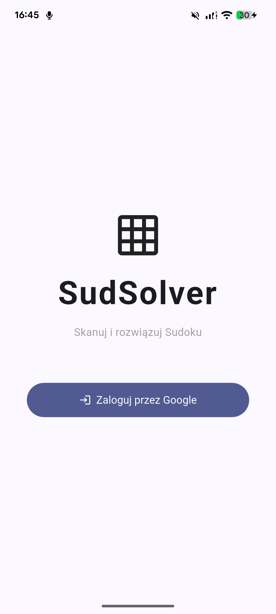
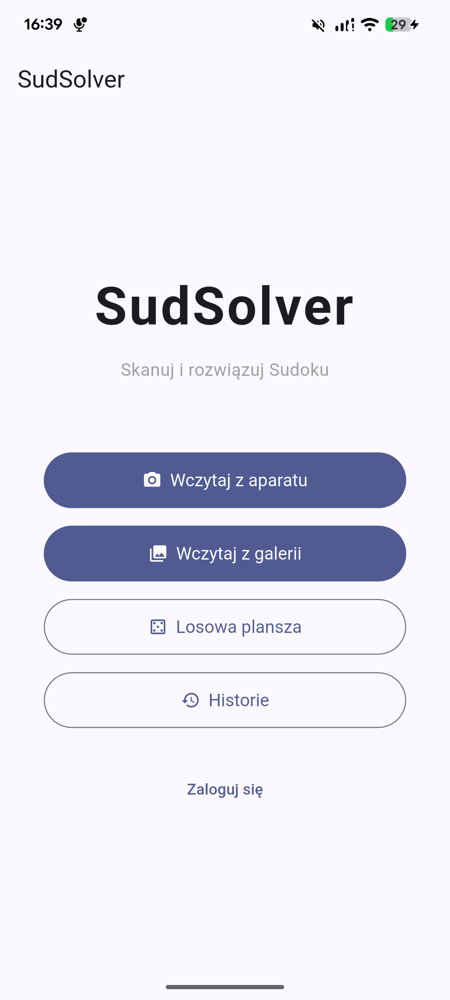
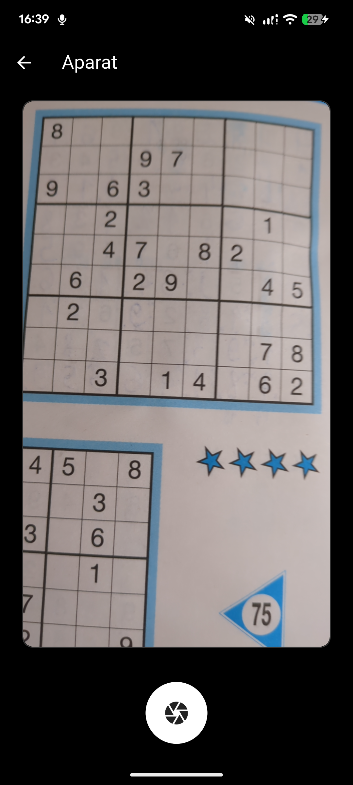
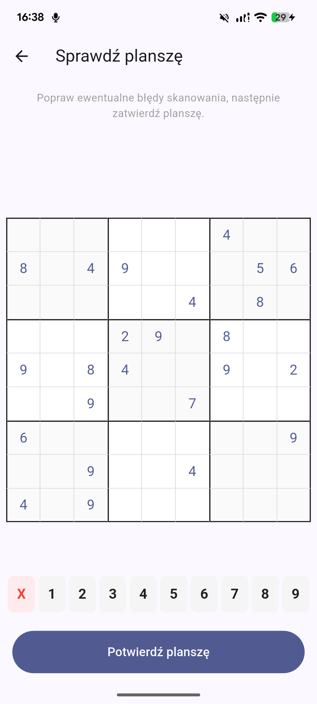
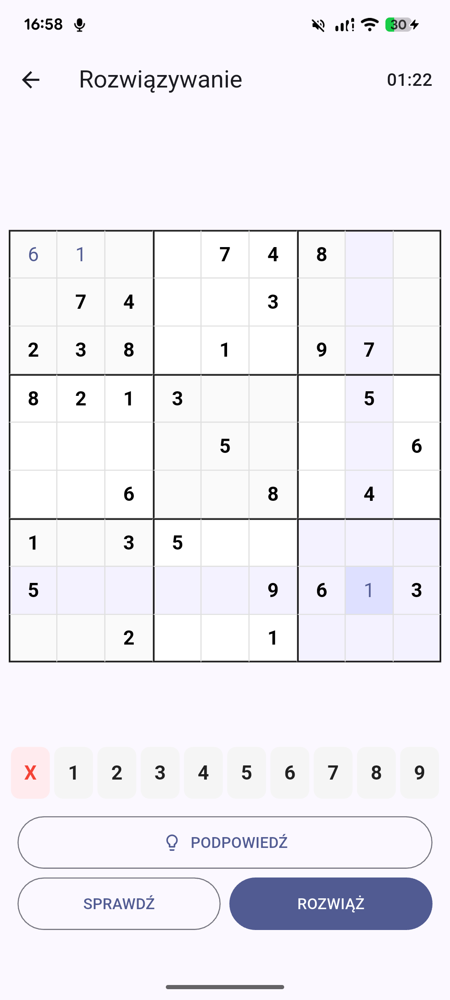
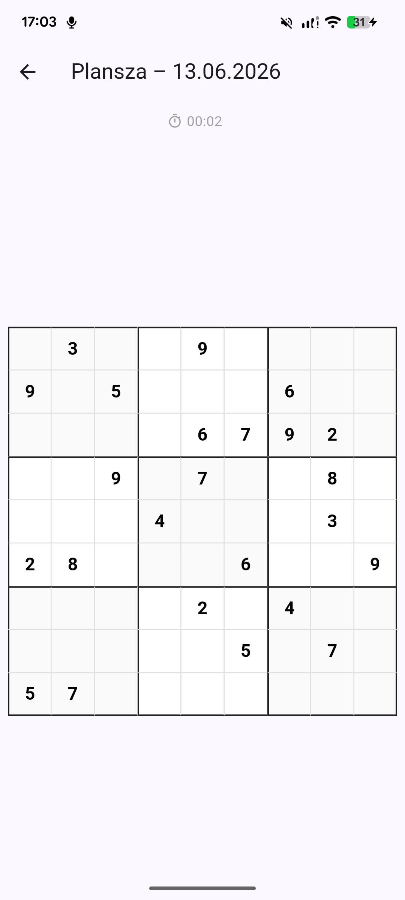
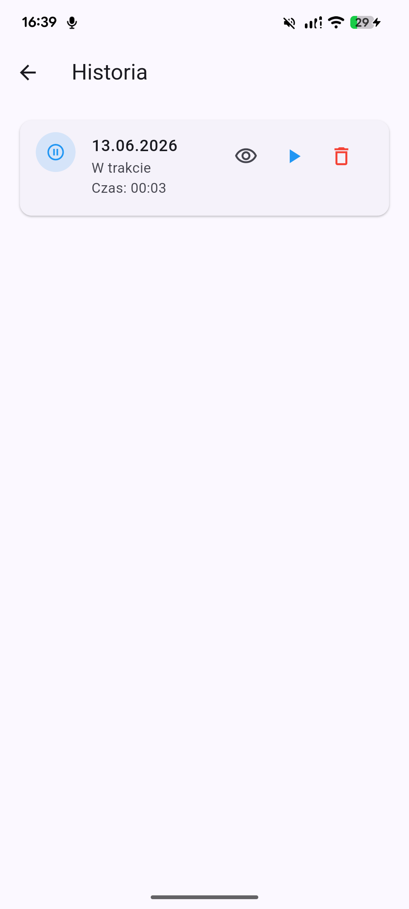

# SudSolver

> Scan, solve, and track Sudoku puzzles.

---

# Project Goal

SudSolver is a mobile Sudoku application built with Flutter. It allows users to scan physical Sudoku puzzles using the camera, solve them manually or automatically, and keep a synchronized history of completed games. The app supports Google sign-in and cloud sync via Firebase, enabling seamless use across devices.

---

# Features


### Advanced OCR & Board Reconstruction
- **Custom OpenCV Engine:** Uses a dedicated C++ and OpenCV implementation on the backend to detect the $9\times9$ Sudoku grid and recognize printed digits from images.
- **Camera & Gallery Integration:** Capture live photos of Sudoku puzzles from newspapers/books or upload existing images directly from the device gallery.
- **Interactive Verification Screen:** Reconstructs the scanned data into a digital grid, allowing users to manually correct any OCR misalignments or typos using an on-screen keypad before confirming the game state.

### Authentication & Cloud Sync
- **Firebase Authentication:** Secure user authentication powered by Firebase Auth, establishing an automated routing flow via an `AuthGate` depending on the session status.
- **Cloud Database Integration:** Connects seamlessly with Cloud Firestore to store user profiles, remote statistics, and cross-device match history securely.

### Smart Gameplay & Solving Logic
- **Interactive Digital Board:** A responsive user interface featuring distinct $3\times3$ subgrid borders for an optimal playing experience.
- **Automated Sudoku Solver:** Stuck in a dead end? A backtracking algorithm can instantly fill the entire board with the correct solution at the tap of a button.
- **Move Validator:** Real-time validation rule enforcement that instantly highlights conflicting or incorrect numbers in red to help players learn and avoid errors.
- **Hint System:** Provides contextual hints during manual solving to guide players through difficult steps without spoiling the full solution.

### Random Puzzle Generation
- **Remote API Connection:** Integrated with an external HTTP puzzle service to fetch and load fresh, random Sudoku boards dynamically from the internet.
- **Instant New Game Trigger:** A dedicated main menu action to generate a random board instantly with a single tap.

### Persistent Game History
- **Smart Progress Saving:** Automatically saves uncompleted Sudoku boards to a local database, preserving the exact state and tracking elapsed time.
- **Resumable Games:** Users can access their archive dashboard to review historical performance or resume unfinished matches right where they left off.

---


# Technology Stack

## Frontend

| Technology           | Purpose                         |
|----------------------|---------------------------------|
| Flutter / Dart       | Cross-platform mobile framework |
| Flutter Riverpod     | State management                |
| Hive                 | Local persistence               |
| Camera / ImagePicker | Image capture for OCR scanning  |

## Backend / Cloud

| Technology        | Purpose                          |
|-------------------|----------------------------------|
| Firebase Auth     | Google Sign-In authentication    |
| Cloud Firestore   | Remote record storage and sync   |
| HTTP API          | Puzzle fetching and OCR scanning |

---

# Project Structure

```text
lib/
├── backend/
│   ├── logic/
│   ├── models/
│   ├── providers/
│   ├── repositories/
│   └── services/
│       ├── auth/
│       ├── puzzle/
│       └── scanner/
└── frontend/
    ├── screens/
    └── widgets/
```

---


# Screens

| Screen Layout | Technical File & Purpose |
|:---:|:---|
|  | **Login Screen**<br>`login_screen.dart`<br><br>The entry point for user authentication. Handles secure sign-in credentials via Google Sign-In linked with Firebase Auth. |
|  | **Home Screen**<br>`home_screen.dart`<br><br>The primary app dashboard and main hub. Serves as the central navigation router to access scanning, random board generation, or history features. |
|  | **Camera Screen**<br>`camera_screen.dart`<br><br>Integrates with the device's native hardware camera to capture live images of physical Sudoku puzzles. |
|  | **Board Confirmation Screen**<br>`board_confirmation_screen.dart`<br><br>Displays the digital $9\times9$ grid parsed by the backend OpenCV OCR engine. Allows manual adjustment and typo correction before starting the game. |
|  | **Solve Screen**<br>`solve_screen.dart`<br><br>The interactive digital gameplay arena. Features real-time move validation (errors highlighted in red), elapsed time tracking, a contextual hint system, and automated backtracking solver access. |
|  | **Board View Screen**<br>`board_view_screen.dart`<br><br>A specialized grid view component optimized for reviewing fully solved games or inspecting historic board layouts without altering any current game state. |
|  | **History Screen**<br>`history_screen.dart`<br><br>The archive log panel. Displays previous matches synced via Hive (local storage) and Cloud Firestore (cloud backup). Permits users to check statistics or resume incomplete games on the fly. |

---

# User Stories

### OCR Scanning
- **As a** Sudoku player,
  **I want to** take a photo of a puzzle in a physical newspaper or book,
  **So that** the application can automatically detect the grid and recognize the numbers.

- **As a** user,
  **I want to** manually correct any misrecognized digits on a preview grid,
  **So that** the solving algorithm operates on perfectly accurate board data.

### Gameplay & Solving Assistance
- **As a** player who is stuck in a dead end,
  **I want to** click a "Solve" button,
  **So that** I can instantly see the full, correct solution and analyze my mistakes.

- **As a** learner,
  **I want to** receive real-time visual feedback for illegal moves,
  **So that** I can instantly know if a number I entered breaks the core rules of Sudoku.

- **As a** regular player,
  **I want to** generate a random board from the internet,
  **So that** I can play even when I don't have a physical newspaper at hand.

### Account & Data Persistence
- **As an** authenticated user,
  **I want to** sign in securely using my Google account,
  **So that** my gaming statistics, profile, and match records are safely stored.

- **As a** mobile user,
  **I want to** have my uncompleted games automatically saved and tracked,
  **So that** I can browse through my archive dashboard and resume any unfinished match right where I left off.

---

# Dependencies

```yaml
flutter_riverpod: ^2.5.1
hive: ^2.2.3
hive_flutter: ^1.1.0
camera: ^0.10.5+9
image_picker: ^1.0.7
firebase_core: ^3.13.1
firebase_auth: ^5.5.3
google_sign_in: ^6.2.2
http: ^1.2.0
http_parser: ^4.0.0
cloud_firestore: ^5.6.12
```

---

# Installation

## Requirements

- Flutter SDK 3.41.9+
- Dart SDK ^3.11.5
- Android SDK (for Android builds)
- Firebase project with `google-services.json`

Check Flutter installation:

```bash
flutter doctor
```

---

# Getting Started

## Clone the Repository

```bash
git clone <repository-url>
cd sudsolver
```

## Install Dependencies

```bash
flutter pub get
```

## Run the Application

```bash
flutter run
```

## Build APK

```bash
flutter build apk
```

## Build App Bundle

```bash
flutter build appbundle
```

---

# Architecture

SudSolver uses a layered architecture with Riverpod for state management and clean separation between backend logic and frontend UI.

Key architectural decisions:

- **`SudokuBoard`** — immutable model; mutations return new instances via `copyWithCell` / `lock`
- **`SudokuSolver`** — backtracking solver operating on raw grids
- **`SudokuValidator`** — stateless validation: move validity, board completeness, invalid cell detection
- **`ISudokuRepository`** — interface implemented by `HiveSudokuRepository` (local) and `FirestoreSudokuRepository` (remote); combined in `SyncedSudokuRepository`
- **`SyncedSudokuRepository`** — writes to local first, fires remote save as fire-and-forget; syncs from cloud on login
- **`SudokuNotifier`** — central game state machine managing scanning, OCR correction, gameplay, hints, timer, and auto-save
- **`HistoryNotifier`** — loads and manages saved game records, reacts to sync status
- **`AuthNotifier`** — wraps `IAuthService`, exposes Google Sign-In and sign-out

---

# Testing

Run all tests:

```bash
flutter test
```

Dependencies:

```yaml
flutter_test:
  sdk: flutter
flutter_lints: ^6.0.0
```

Implemented unit tests:

| File | Covered class | What's tested |
|------|--------------|---------------|
| `sudoku_board_test.dart` | `SudokuBoard` | Empty board creation, `copyWithCell` immutability, `lock` marking fixed cells |
| `sudoku_state_test.dart` | `SudokuState` | Default values, `hasSelection`, `isSelected`, `isEditable`, `canSolve`, `canEditCell`, `isCellInvalid`, `copyWith` sentinel behavior |
| `sudoku_validator_test.dart` | `SudokuValidator` | `isValidMove` (row/col/box conflicts, self-check), `isBoardValid`, `isBoardComplete`, `getInvalidCells` (duplicate detection in all three dimensions) |
| `sudoku_solver_test.dart` | `SudokuSolver` | Solves a valid puzzle, preserves given digits, handles already-complete board, does not mutate original |
| `sudoku_notifier_test.dart` | `SudokuNotifier` | Cell selection, value updates, validation, OCR confirmation, scan flow, auto-solve, hints, reset, progress saving, dispose auto-save, userId propagation |
| `history_notifier_test.dart` | `HistoryNotifier` | Load success/error/concurrent guard, optimistic delete, rollback on failure |

---

# CI/CD

| Workflow     | Trigger                        | Action                                              |
|--------------|--------------------------------|-----------------------------------------------------|
| `test.yml`   | Push to `main`, `backend`, `frontend`; PR to `main` | Dart analyze + `flutter test`           |
| `build.yml`  | Push to `main`                 | Build profile APK → Firebase App Distribution      |
| `release.yml`| Push tag `v*`                  | Build release APK (split ABI + full) + AAB → GitHub Release |

---

# Security

Firebase Authentication handles identity. Records in Firestore are stored under the authenticated user's UID (`users/{uid}/sudoku_records`), so each user can only access their own data.

---

# Version

```yaml
version: 0.3.0
```

---

# Team & Roles

| Member        | Role               | Responsibilities                                                                                                 |
|---------------|--------------------|------------------------------------------------------------------------------------------------------------------|
| **WyrwaMichal8** | Frontend Developer | UI/UX implementation, layout engineering, responsive board views, camera & image screens setup, validation styling. |
| **Mihvv**     | Backend Developer  | Data layer architecture (Hive, Firestore, sync), Firebase Auth integration, HTTP services (OCR scanner, puzzle API), Riverpod state management, Sudoku solver & validator logic  |
| **aspencode** | Project Leader     | Conceptual design, project management, product vision, lifecycle roadmap (defining scopes for versions/releases), technical documentation writing (README), maintaining the project backlog, updating CHANGELOGs, and managing issue tracking.  |

---

# Repositories

* Project: https://github.com/Mihvv/SudSolver
* Sudoku Scanner API: https://github.com/Mihvv/sudoku-api

---

# Summary

**SudSolver** is a mobile application built with Flutter designed to seamlessly bridge physical Sudoku puzzles with digital solving mechanics. 

The project follows a clean, decoupled architecture divided into a **Frontend** layer and a **Backend** infrastructure:

* **Core Innovation (OCR & Processing):** At the heart of SudSolver is an advanced image processing workflow. Using a dedicated C++ and OpenCV backend engine, the app captures live photos or gallery uploads of physical paper Sudokus, automatically isolates the $9\times9$ matrix, and reconstructs it into an interactive digital board via OCR digit recognition.
* **State Management & Logic:** Application states, user actions, and game data flows are reactively managed using the Riverpod framework. Core game mechanics include move validation (with visual error highlighting), a hint generator, and an instant, recursive backtracking solver algorithm.
* **Data Persistence & Cloud Sync:** The application features a hybrid data layer designed for both offline capability and cross-device synchronization. Local matches and elapsed time counters are instantly persisted using Hive (a lightweight key-value database). When authenticated securely through Firebase Auth (Google Sign-In), local match histories, performance statistics, and user profiles are automatically backed up and synced to Cloud Firestore.
* **Dynamic Content:** To ensure endless replayability, the system connects via an HTTP service layer to an external Puzzle API, allowing users to dynamically pull and generate fresh, random Sudoku boards directly from the internet.

